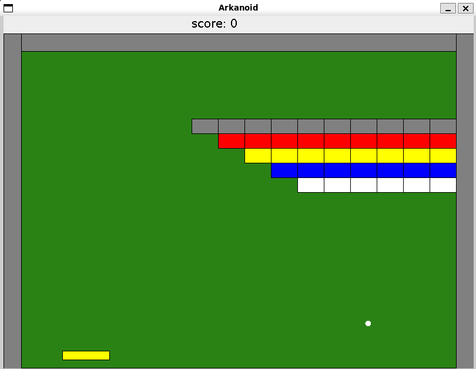

# Arkanoid Game 🎮

A classic Arkanoid/Breakout game implementation in Java with modern object-oriented design patterns.

## 📺 Game Demo

### Screenshot

*The game in action showing the paddle, balls, colorful blocks, and score display*

### Video Demo
*Full gameplay demonstration showing ball physics, block destruction, paddle control, and scoring system*

https://github.com/Eviatar294/Arkanoid-Game/blob/main/images/running_recording.mp4


## 📋 Table of Contents
- [About](#about)
- [Features](#features)
- [Installation](#installation)
- [How to Run](#how-to-run)
- [Game Controls](#game-controls)
- [Project Structure](#project-structure)
- [Technical Details](#technical-details)
- [Game Mechanics](#game-mechanics)
- [Author](#author)

## 🎯 About

This is a Java implementation of the classic Arkanoid game, developed as part of an Object-Oriented Programming course assignment. The game features a paddle-controlled ball that must destroy blocks while avoiding falling off the screen.

## ✨ Features

- **Classic Arkanoid Gameplay**: Control a paddle to bounce balls and destroy blocks
- **Multiple Balls**: Game starts with 3 balls for extended gameplay
- **Colorful Block Arrangement**: 5 rows of blocks with different colors (Gray, Red, Yellow, Blue, White)
- **Scoring System**: Earn points for destroying blocks with bonus points for clearing all blocks
- **Collision Detection**: Precise collision detection between balls, blocks, paddle, and boundaries
- **Game States**: Win condition (all blocks destroyed) and lose condition (all balls lost)
- **Smooth Animation**: 60 FPS game loop for fluid gameplay
- **Modern UI**: Clean graphics with score display

## 🛠️ Installation

### Prerequisites
- Java Development Kit (JDK) 8 or higher
- Apache Ant (for building)

### Setup
1. Clone or download the project
2. Ensure the `biuoop-1.4.jar` library is in the project root directory
3. Make sure Java and Ant are properly installed on your system

## 🚀 How to Run

### Using Ant (Recommended)
```bash
# Compile the project
ant compile

# Run the game
ant run

# Clean build files
ant clean
```

### Manual Compilation
```bash
# Compile
javac -cp "biuoop-1.4.jar" -d bin src/*.java src/**/*.java src/**/**/*.java

# Run
java -cp "bin:biuoop-1.4.jar" Ass5Game
```

## 🎮 Game Controls

- **Left/Right Arrow Keys**: Move the paddle left and right
- **Game Objective**: 
  - Use the paddle to bounce the balls
  - Destroy all blocks to win
  - Don't let all balls fall off the screen

## 📁 Project Structure

```
ass5/
├── src/
│   ├── Ass5Game.java                 # Main application entry point
│   ├── game/                         # Core game logic
│   │   ├── Game.java                 # Main game class and loop
│   │   ├── GameEnvironment.java      # Collision environment
│   │   ├── SpriteCollection.java     # Sprite management
│   │   ├── CollisionInfo.java        # Collision information
│   │   └── Counter.java              # Game counters
│   ├── geometry/                     # Geometric primitives and game objects
│   │   ├── primitives/               # Basic geometric shapes
│   │   │   ├── Point.java
│   │   │   ├── Line.java
│   │   │   └── Rectangle.java
│   │   └── advanced/                 # Game objects
│   │       ├── Ball.java             # Ball implementation
│   │       ├── Block.java            # Block implementation
│   │       ├── Paddle.java           # Paddle implementation
│   │       └── Velocity.java         # Velocity handling
│   ├── hit_listeners/                # Event handling system
│   │   ├── HitListener.java          # Hit event interface
│   │   ├── HitNotifier.java          # Hit notification interface
│   │   ├── BallRemover.java          # Ball removal handler
│   │   ├── BlockRemover.java         # Block removal handler
│   │   └── ScoreTrackingListener.java # Score tracking
│   └── objects_in_game/              # Game object interfaces
│       ├── Sprite.java               # Drawable game objects
│       ├── Collidable.java           # Collision-enabled objects
│       └── ScoreIndicator.java       # Score display
├── images/                           # Game screenshots and recordings
├── biuoop-1.4.jar                   # Graphics library
├── build.xml                        # Ant build configuration
└── README.md                        # This file
```

## 🔧 Technical Details

### Design Patterns Used
- **Observer Pattern**: Hit listeners for game events
- **Strategy Pattern**: Different collision behaviors
- **Composite Pattern**: Sprite collections
- **Template Method**: Game loop structure

### Key Components
- **Game Loop**: 60 FPS animation loop with proper timing
- **Collision Detection**: Line-rectangle intersection algorithms
- **Event System**: Hit listeners for block destruction and ball removal
- **Sprite Management**: Efficient rendering and updating of game objects

### Game Configuration
- **Screen Size**: 800x600 pixels
- **Ball Speed**: 4 pixels per frame
- **Paddle Speed**: 5 pixels per frame
- **Number of Balls**: 3
- **Block Arrangement**: 5 rows (5, 6, 7, 8, 9 blocks per row)

## 🎮 Game Mechanics

### Scoring
- **Block Destruction**: 5 points per block
- **Level Completion**: 100 bonus points for clearing all blocks

### Win/Lose Conditions
- **Win**: Destroy all blocks
- **Lose**: All balls fall off the screen

### Block Layout
The game features a pyramid-like arrangement of blocks:
- **Row 1 (Gray)**: 9 blocks
- **Row 2 (Red)**: 8 blocks  
- **Row 3 (Yellow)**: 7 blocks
- **Row 4 (Blue)**: 6 blocks
- **Row 5 (White)**: 5 blocks

## 👨‍💻 Author

**Eviatar Sayada**
- Student ID: 216756650
- Email: eviatar294@gmail.com
- Version: 1.0
- Date: July 9, 2024

---

*This project was developed as part of an Object-Oriented Programming course assignment, demonstrating advanced Java programming concepts including inheritance, polymorphism, design patterns, and event-driven programming.* 
